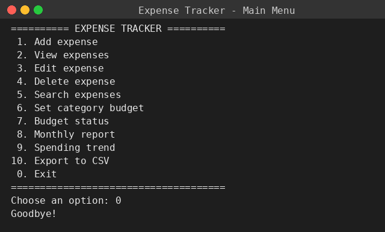
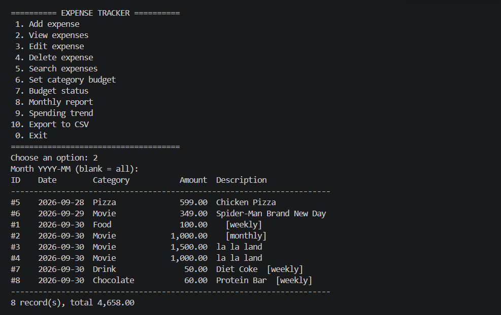
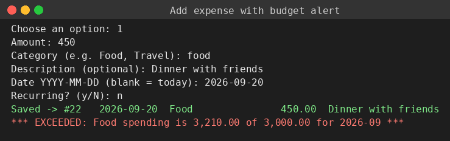
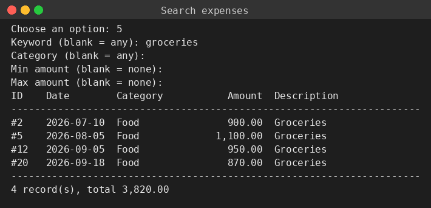
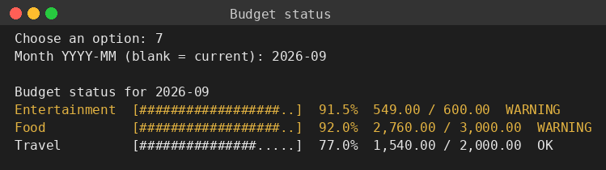
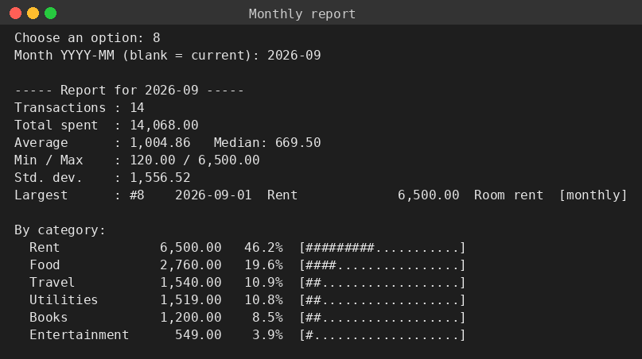
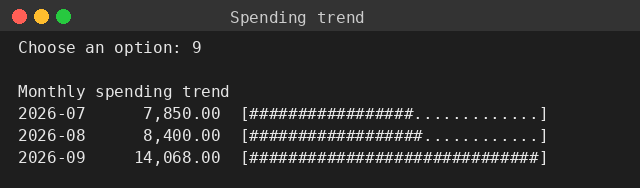
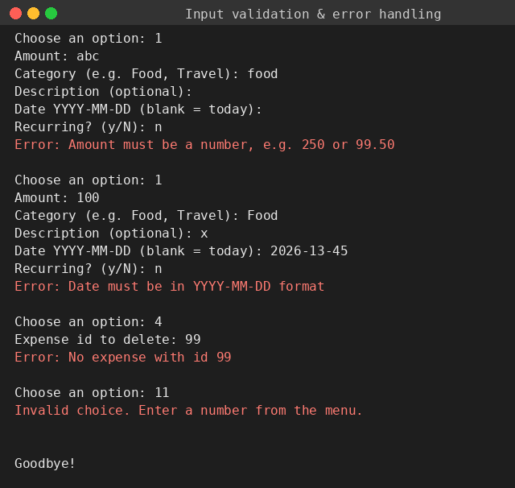

# Expense Tracker & Analyzer

A lightweight, offline command-line application for recording personal expenses, watching
category budgets and generating monthly reports. Built in Python as the **Build Your Own Project**
for the *Python Essentials* course (VITyarthi).

## Overview
Most people do not know where their money goes each month. This tool lets you log expenses in
seconds, warns you when a category budget is close to (or over) its limit, and turns the raw
entries into statistics, category breakdowns and trends. All data stays in a local JSON file.

See [statement.md](statement.md) for the full problem statement, scope and target users.

## Features
**1. Expense management** - add, view, edit, delete and search expenses; recurring expenses (weekly / monthly / yearly).
**2. Budgets & alerts** - monthly limit per category; a WARNING at 80% and EXCEEDED above 100%, shown instantly when you add an expense; text progress bars in the budget status view.
**3. Reports & analytics** - monthly summary (total, mean, median, min/max, standard deviation, largest expense), category breakdown with percentages, month-by-month spending trend and CSV export.

### Non-functional requirements
| Requirement | How it is met |
|---|---|
| Reliability | Atomic writes (temp file then replace) and a `.bak` backup on every save; a damaged data file is preserved as `.corrupt` and the app reports it instead of crashing |
| Usability | Numbered menu, clear prompts, friendly error messages, blank input = sensible default, confirmation before delete |
| Error handling | Validation on every input; custom exceptions (`ValidationError`, `NotFoundError`, `StorageError`); a last-resort handler so the menu never crashes |
| Logging | Every action, warning and error is written to `logs/app.log` |
| Maintainability | Small modules with one responsibility each: models, storage, services, utils; docstrings and comments throughout |

## Technologies used
- Python 3.9+ (standard library: `json`, `csv`, `logging`, `argparse`, `itertools`, `datetime`)
- NumPy (statistics)
- Git / GitHub (version control)

Python concepts from the course that are applied: data types and operators, string formatting,
lists / dicts / sets, control flow, functions (including `*args`-style flexible arguments via `**changes`),
modules and packages, `itertools.groupby`, NumPy arrays, and OOP (classes, encapsulation with
properties, inheritance, method overriding, operator overloading, class and static methods).

## Project structure
```
expense-tracker/
├── README.md
├── statement.md
├── main.py              # menu and user interaction
├── requirements.txt
├── screenshots/         # program output
└── modules/
    ├── models.py        # Expense, RecurringExpense, Budget
    ├── services.py      # expense CRUD, budgets/alerts, reports
    ├── storage.py       # JSON persistence, backup, CSV export
    └── utils.py         # logger, validators, formatting
```
`data/`, `logs/` and `exports/` are created automatically on first use and are not tracked by Git.

## Install & run
```bash
git clone <your-repository-url>
cd expense-tracker
pip install -r requirements.txt
python main.py
```
To use a separate data file (for example while experimenting): `python main.py --data demo.json`

## Testing
Run the program and try the cases below (the same cases appear in `screenshots/08_validation_and_errors.png`).

| # | Action | Input | Expected result |
|---|---|---|---|
| 1 | Add expense | amount `abc` | `Error: Amount must be a number` |
| 2 | Add expense | amount `-5` | `Error: Amount must be greater than zero` |
| 3 | Add expense | empty category | `Error: Category cannot be empty` |
| 4 | Add expense | date `2026-13-45` | `Error: Date must be in YYYY-MM-DD format` |
| 5 | Add recurring expense | frequency `daily` | `Error: Frequency must be weekly, monthly or yearly` |
| 6 | Delete expense | id `99` (not present) | `Error: No expense with id 99` |
| 7 | Main menu | option `11` | `Invalid choice` message, menu shown again |
| 8 | Budget alert | Food budget 3000, then add Food expenses beyond it | `WARNING` at 80%, `EXCEEDED` above 100% |
| 9 | Corrupt data | replace `data/expenses.json` with `{ not json` and start the app | "Data file is damaged" message; a `.corrupt` copy is kept |
| 10 | Report | month with no data | "No expenses recorded" message |

Check `logs/app.log` afterwards to see every action and error that was logged.

## Screenshots
| | |
|---|---|
|  |  |
|  |  |
|  |  |
|  |  |

## Future enhancements
Charts with matplotlib, income tracking, automatic creation of recurring entries, and a simple GUI.
